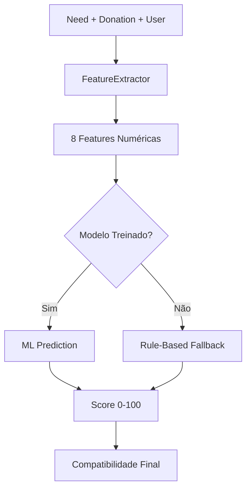

# GSAuth - Sistema de Doações com ML

## 📋 Sobre o Projeto

O **GSAuth** é uma plataforma de gerenciamento de doações que utiliza Machine Learning para otimizar o matching entre necessidades e doações. O sistema conecta doadores, organizações beneficentes e pessoas em necessidade através de um algoritmo inteligente de compatibilidade.

### 🎯 Funcionalidades Principais

- **Autenticação JWT**: Sistema seguro de login e registro
- **Gestão de Usuários**: Diferentes tipos de usuários (Doador, Membro de ONG, Admin)
- **Cadastro de Necessidades**: ONGs podem cadastrar necessidades específicas
- **Registro de Doações**: Doadores podem oferecer itens para doação
- **Matching Inteligente**: Algoritmo ML que calcula compatibilidade entre doações e necessidades
- **Sistema de Organizações**: Gestão de ONGs e organizações beneficentes

## ▶ Vídeo Pitch

### [https://youtu.be/k7BIZsI4AwE](https://youtu.be/k7BIZsI4AwE)

## 🏗️ Arquitetura

### Estrutura do Projeto

```
GSAuth/
├── Controllers/           # Controllers da API
│   ├── AuthController.cs         # Autenticação
│   ├── ModelsController/          # CRUD dos modelos
│   │   ├── DonationController.cs
│   │   ├── MatchController.cs
│   │   ├── NeedController.cs
│   │   └── OrganizationController.cs
│   └── TestController.cs          # Endpoints de teste
├── DTOs/                  # Data Transfer Objects
├── Infrastructure/        # Configuração do banco
├── ML/                   # Machine Learning
│   ├── Models/                   # Modelos ML
│   └── Services/                 # Serviços ML
├── Models/               # Entidades do domínio
├── Repositories/         # Camada de dados
└── Services/             # Lógica de negócio

GSAuth.Test/
└── Services/             # Testes do Modelo ML
    ├── Integration/               # Autenticação
    ├── Performance/               # CRUD dos modelos
    ├── Services/                  
    └── TestHelpers.cs             # Endpoints de teste
```

### 🤖 Sistema de Machine Learning

O sistema utiliza **Microsoft ML.NET** para criar um modelo de compatibilidade que analisa:

- **Correspondência de Categoria**: Compatibilidade entre tipos de itens
- **Distância Geográfica**: Proximidade entre doador e beneficiário
- **Proporção de Quantidade**: Relação entre quantidade oferecida e necessária
- **Fator de Urgência**: Prioridade da necessidade
- **Fator Temporal**: Proximidade de prazos
- **Confiabilidade do Doador**: Histórico de doações
- **Credibilidade da Organização**: Reputação da ONG

## 🛠️ Tecnologias Utilizadas

### Backend
- **.NET 8**: Framework principal
- **ASP.NET Core**: Web API
- **Entity Framework Core**: ORM
- **Oracle Database**: Banco de dados
- **ML.NET**: Machine Learning
- **JWT**: Autenticação
- **AutoMapper**: Mapeamento de objetos

### Testes
- **xUnit**: Framework de testes
- **Moq**: Mock objects
- **FluentAssertions**: Assertions fluentes

### DevOps
- **Docker**: Containerização
- **Swagger**: Documentação da API

## 📦 Instalação e Configuração

### Pré-requisitos

- .NET 8 SDK
- Oracle Database
- Docker (opcional)

### 1. Clone o Repositório

```bash
git clone https://github.com/seu-usuario/GSAuth.git
cd GSAuth
```

### 2. Configuração do Banco de Dados

Edite o arquivo `appsettings.json`:

```json
{
  "ConnectionStrings": {
    "DefaultConnection": "Data Source=seu-servidor:1521/orcl;User Id=seu-usuario;Password=sua-senha;"
  },
  "Jwt": {
    "Secret": "SuaChaveSecreta_MinimoDe32Caracteres",
    "ExpirationMinutes": 60
  }
}
```

### 3. Executar Migrações

```bash
dotnet ef database update
```

### 4. Executar a Aplicação

```bash
dotnet run
```

A API estará disponível em: `https://localhost:5000/swagger`

### 🐳 Usando Docker

```bash
# Build da imagem
docker build -t gsauth .

# Executar container
docker run -p 8080:8080 gsauth
```

## 🔑 Endpoints Principais

### Autenticação

```http
POST /api/auth/register    # Registro de usuário
POST /api/auth/login       # Login
GET /api/auth/me          # Perfil do usuário
POST /api/auth/change-password  # Alterar senha
DELETE /api/auth/delete-account # Deletar conta
```

### Necessidades

```http
GET /api/need             # Listar necessidades
POST /api/need            # Criar necessidade
PUT /api/need/{id}        # Atualizar necessidade
DELETE /api/need/{id}     # Deletar necessidade
```

### Doações

```http
GET /api/donation         # Listar doações
POST /api/donation        # Criar doação
PUT /api/donation/{id}    # Atualizar doação
DELETE /api/donation/{id} # Deletar doação
```

### Matches (ML)

```http
GET /api/match            # Listar matches
POST /api/match           # Criar match
POST /api/match/calculate-compatibility  # Calcular compatibilidade
POST /api/match/train-model             # Treinar modelo ML
GET /api/match/model-status             # Status do modelo
```

## 👥 Tipos de Usuário

### 1. **DONOR** (Doador)
- Pode criar doações
- Visualizar matches de suas doações
- Gerenciar perfil pessoal

### 2. **NGO_MEMBER** (Membro de ONG)
- Pode criar necessidades
- Gerenciar necessidades da organização
- Aceitar/rejeitar matches

### 3. **ADMIN** (Administrador)
- Acesso total ao sistema
- Gerenciar usuários e organizações
- Treinar modelos ML

# Testes de Machine Learning - GSAuth

Este documento descreve a estrutura e implementação dos testes unitários e de integração para o sistema de Machine Learning de compatibilidade entre necessidades e doações do projeto GSAuth.

## 📋 Visão Geral

O sistema de ML utiliza o **Microsoft.ML** para criar um modelo de compatibilidade que avalia a adequação entre necessidades (needs) e doações (donations), considerando múltiplos fatores como categoria, localização, urgência, confiabilidade do doador e histórico da organização.

## 🏗️ Estrutura dos Testes

### Dependências Principais
```xml
<PackageReference Include="xunit" Version="2.5.3" />
<PackageReference Include="Moq" Version="4.20.69" />
<PackageReference Include="FluentAssertions" Version="6.12.0" />
<PackageReference Include="Microsoft.ML" Version="4.0.2" />
<PackageReference Include="Microsoft.ML.FastTree" Version="4.0.2" />
```

### Organização dos Testes

```
GSAuth.Tests/ML/
├── Integration/
│   └── MLIntegrationTests.cs          # Testes end-to-end completos
├── Performance/
│   └── PerformanceTests.cs            # Testes de desempenho
├── Services/
│   ├── CompatibilityMLServiceTests.cs # Testes do serviço principal
│   └── FeatureExtractorTests.cs       # Testes de extração de features
└── TestHelpers/
    └── TestDataBuilder.cs             # Builder para dados de teste
```

## 🧪 Tipos de Testes

### 1. Testes de Integração (`MLIntegrationTests`)

**Objetivo**: Validar o fluxo completo do sistema ML

#### Cenários Testados:
- **End-to-End Training e Prediction**: Verifica o ciclo completo de treinamento e predição
- **Model Persistence**: Testa se o modelo é salvo e carregado corretamente após reinicialização
- **Thread Safety**: Executa 50 predições simultâneas para validar concorrência

```csharp
[Fact]
public async Task EndToEnd_TrainAndPredict_ShouldWorkCorrectly()
{
    // Testa predição inicial (fallback) → treinamento → predição com modelo
    var initialScore = await _mlService.PredictCompatibilityAsync(need, donation, donor);
    await _mlService.TrainModelAsync();
    var trainedScore = await _mlService.PredictCompatibilityAsync(need, donation, donor);
    
    // Ambos os scores devem estar no range válido [0-100]
}
```

### 2. Testes de Performance (`PerformanceTests`)

**Objetivo**: Garantir que o sistema atenda aos requisitos de performance

#### Métricas Validadas:
- **Predição**: < 10ms por predição (média de 100 execuções)
- **Treinamento**: < 30 segundos para completar

```csharp
[Fact]
public async Task PredictionPerformance_ShouldBeFastEnough()
{
    // Mede tempo de 100 predições consecutivas
    // Valida que a média seja < 10ms
}
```

### 3. Testes do Serviço Principal (`CompatibilityMLServiceTests`)

**Objetivo**: Validar a lógica de negócio do `CompatibilityMLService`

#### Cenários Principais:

**Fallback sem Modelo Treinado**:
```csharp
[Fact]
public async Task PredictCompatibilityAsync_WithoutTrainedModel_ShouldUseFallback()
{
    // Verifica se o sistema funciona antes do treinamento usando algoritmo de fallback
}
```

**Cenários de Compatibilidade**:
```csharp
[Theory]
[InlineData("FOOD", "FOOD", "HIGH", 0, 0, 1.0)]     // Match perfeito
[InlineData("FOOD", "CLOTHING", "LOW", 10, 5, 0.5)] // Categorias diferentes
[InlineData("MEDICAL", "MEDICAL", "HIGH", -1, 0, 0.0)] // Prazo vencido
public async Task PredictCompatibilityAsync_WithVariousScenarios_ShouldReturnExpectedRanges(...)
```

### 4. Testes de Extração de Features (`FeatureExtractorTests`)

**Objetivo**: Validar a extração e cálculo das features utilizadas pelo modelo

#### Features Testadas:

**Compatibilidade de Categoria**:
- `FOOD` + `FOOD` = 1.0 (match exato)
- `FOOD` + `BEVERAGES` = 0.7 (categorias relacionadas)
- `FOOD` + `CLOTHING` = 0.1 (categorias diferentes)

**Ratio de Quantidade**:
```csharp
[Theory]
[InlineData(100, 100, 1.0f)]  // Quantidades iguais
[InlineData(100, 50, 0.5f)]   // Doação cobre 50% da necessidade
[InlineData(50, 100, 0.5f)]   // Doação excede a necessidade
```

**Fator de Urgência**:
- `HIGH` = 1.0
- `MEDIUM` = 0.7
- `LOW` = 0.4

**Confiabilidade do Doador** (baseada no tempo de cadastro):
- 30 dias = 0.5 (novo)
- 90 dias = 0.7 (estabelecido)  
- 200+ dias = 0.9 (veterano)

## 🔧 Utilitários de Teste

### TestDataBuilder

Classe helper para criar dados de teste consistentes:

```csharp
// Criar necessidade personalizada
var need = TestDataBuilder.CreateTestNeed(
    category: "FOOD",
    location: "São Paulo, SP",
    priority: "HIGH",
    quantity: 100,
    deadline: DateTime.Now.AddDays(3)
);

// Criar doação padrão
var donation = TestDataBuilder.CreateTestDonation();

// Criar usuário com histórico específico
var donor = TestDataBuilder.CreateTestUser(createdAt: DateTime.Now.AddDays(-365));
```

## 🎯 Estratégias de Teste

### 1. Isolamento de Dependências
- Uso do **Moq** para mockar `IWebHostEnvironment`
- Diretórios temporários únicos para cada teste
- Cleanup automático via `IDisposable`

### 2. Validação de Ranges
- Todos os scores devem estar entre 0-100
- Verificação de valores especiais (NaN, Infinity)
- Tolerância para variações em cenários probabilísticos

### 3. Testes Paramétricos
- Uso extensivo de `[Theory]` e `[InlineData]`
- Coverage de múltiplos cenários com dados variados
- Validação de edge cases

## 🚀 Execução dos Testes

### Comandos básicos:
```bash
# Executar todos os testes ML
dotnet test --filter "FullyQualifiedName~GSAuth.Tests.ML"

# Executar apenas testes de integração
dotnet test --filter "FullyQualifiedName~MLIntegrationTests"

# Executar com coverage
dotnet test --collect:"XPlat Code Coverage"
```

### Collection para Integração
```csharp
[Collection("ML Integration Tests")]
public class MLIntegrationTests : IDisposable
```
Os testes de integração usam uma collection para evitar execução paralela que poderia causar conflitos de arquivo.

## 📊 Métricas de Qualidade

### Coverage Esperado:
- **Serviços ML**: > 90%
- **Feature Extraction**: > 95%
- **Cenários de Negócio**: 100%

### Critérios de Sucesso:
- ✅ Todos os testes passam consistentemente
- ✅ Performance dentro dos limites estabelecidos
- ✅ Thread safety validada
- ✅ Persistência de modelo funcional
- ✅ Fallback robusto quando modelo não disponível

## 🔍 Debugging e Troubleshooting

### Problemas Comuns:
1. **Falha na criação de diretório temporário**: Verificar permissões
2. **Timeout nos testes de performance**: Verificar recursos da máquina
3. **Model file not found**: Verificar se o treinamento completou com sucesso

### Logs Úteis:
- Tempo de execução de cada predição
- Localização dos arquivos de modelo temporários
- Scores detalhados para debugging de features

---

# Sistema de Machine Learning - Compatibilidade GSAuth

Este documento descreve o sistema de Machine Learning desenvolvido para avaliar a compatibilidade entre necessidades (needs) e doações (donations) no projeto GSAuth, utilizando **Microsoft.ML** para criar predições inteligentes de correspondência.

## 🎯 Objetivo

O sistema ML foi projetado para automatizar e otimizar o processo de matchmaking entre doações e necessidades, considerando múltiplos fatores como categoria, localização, urgência, histórico do doador e confiabilidade da organização.

## 🏗️ Arquitetura do Sistema

### Componentes Principais

```
GSAuth/ML/
├── Models/
│   └── MatchData.cs               # Modelos de dados para ML
├── Services/
│   ├── CompatibilityMLService.cs  # Serviço principal de ML
│   ├── FeatureExtractor.cs        # Extração de características
│   └── ICompatibilityMLService.cs # Interface do serviço
```

### Fluxo de Funcionamento



## 🔧 Modelo de Dados

### MatchData - Features de Entrada

```csharp
public class MatchData
{
    [LoadColumn(0)] public float CategoryMatch { get; set; }        // Compatibilidade de categoria (0-1)
    [LoadColumn(1)] public float LocationDistance { get; set; }    // Distância normalizada (0-1)
    [LoadColumn(2)] public float QuantityRatio { get; set; }       // Proporção de quantidade (0-1)
    [LoadColumn(3)] public float UrgencyFactor { get; set; }       // Fator de urgência (0-1)
    [LoadColumn(4)] public float TimeFactor { get; set; }          // Proximidade do deadline (0-1)
    [LoadColumn(5)] public float ExpirationFactor { get; set; }    // Proximidade da expiração (0-1)
    [LoadColumn(6)] public float DonorReliability { get; set; }    // Confiabilidade do doador (0-1)
    [LoadColumn(7)] public float OrganizationTrust { get; set; }   // Confiança na organização (0-1)
    [LoadColumn(8)] public float CompatibilityScore { get; set; }  // Score alvo (0-100)
}
```

### MatchPrediction - Saída do Modelo

```csharp
public class MatchPrediction
{
    [ColumnName("Score")] public float CompatibilityScore { get; set; }
}
```

## 🧠 Extração de Features

### 1. CategoryMatch - Compatibilidade de Categoria

**Algoritmo**: Matching exato e por similaridade

```csharp
// Exemplos de scoring:
"FOOD" + "FOOD" = 1.0f          // Match perfeito
"FOOD" + "BEVERAGES" = 0.7f     // Categorias relacionadas
"FOOD" + "CLOTHING" = 0.1f      // Sem relação
```

**Categorias Relacionadas**:
- `FOOD` → `BEVERAGES`, `NUTRITION`
- `CLOTHING` → `SHOES`, `ACCESSORIES`
- `MEDICAL` → `PHARMACY`, `HEALTH`
- `EDUCATION` → `BOOKS`, `SUPPLIES`

### 2. LocationDistance - Distância Geográfica

**Algoritmo**: Similaridade por string + Distância de Levenshtein

```csharp
// Processo:
1. Normalização de strings (lowercase, trim)
2. Cálculo da distância de Levenshtein
3. Conversão para similaridade: 1.0 - (distance / maxLength)
4. Inversão para distância: 1.0 - similarity
```

### 3. QuantityRatio - Proporção de Quantidade

**Fórmula**: `min(need, donation) / max(need, donation)`

```csharp
// Exemplos:
Need: 100kg, Donation: 100kg → Ratio: 1.0  // Perfeito
Need: 100kg, Donation: 50kg  → Ratio: 0.5  // Doação cobre 50%
Need: 50kg,  Donation: 100kg → Ratio: 0.5  // Doação excede em 2x
```

### 4. UrgencyFactor - Fator de Urgência

**Mapeamento de Prioridades**:
```csharp
"HIGH"   → 1.0f  // Urgente
"MEDIUM" → 0.7f  // Moderado
"LOW"    → 0.4f  // Baixa prioridade
null     → 0.5f  // Não especificado
```

### 5. TimeFactor - Proximidade do Deadline

**Escala Temporal**:
```csharp
≤ 0 dias    → 0.0f  // Prazo vencido
≤ 1 dia     → 1.0f  // Muito urgente
≤ 7 dias    → 0.8f  // Urgente
≤ 30 dias   → 0.6f  // Moderado
> 30 dias   → 0.4f  // Não urgente
```

### 6. ExpirationFactor - Validade da Doação

**Escala de Validade**:
```csharp
≤ 0 dias    → 0.0f  // Expirado
≤ 3 dias    → 0.3f  // Expira em breve
≤ 7 dias    → 0.7f  // Algum tempo restante
> 7 dias    → 1.0f  // Boa validade
null        → 1.0f  // Não perecível
```

### 7. DonorReliability - Confiabilidade do Doador

**Baseado no Tempo de Cadastro**:
```csharp
< 30 dias   → 0.5f  // Doador novo
< 180 dias  → 0.7f  // Doador estabelecido
≥ 180 dias  → 0.9f  // Doador veterano
```

### 8. OrganizationTrust - Confiança na Organização

**Histórico Organizacional**:
```csharp
null        → 0.6f  // Necessidade individual
< 90 dias   → 0.6f  // Organização nova
< 365 dias  → 0.8f  // Organização estabelecida
≥ 365 dias  → 1.0f  // Organização veterana
```

## 🚀 Algoritmo de Machine Learning

### Configuração do Modelo

**Framework**: Microsoft.ML com FastTree Regressor

```csharp
var pipeline = _mlContext.Transforms.Concatenate("Features", /* todas as 8 features */)
    .Append(_mlContext.Regression.Trainers.FastTree(
        numberOfLeaves: 20,           // Complexidade da árvore
        numberOfTrees: 100,           // Número de árvores no ensemble
        minimumExampleCountPerLeaf: 10,  // Mínimo de exemplos por folha
        learningRate: 0.2             // Taxa de aprendizado
    ));
```

### Treinamento

**Dados Sintéticos**: Geração de 1000 amostras com ruído gaussiano

```csharp
// Fórmula para score sintético:
targetScore = (CategoryMatch * 30) +
              (LocationDistance * 20) +
              (QuantityRatio * 15) +
              (UrgencyFactor * 10) +
              (TimeFactor * 10) +
              (ExpirationFactor * 8) +
              (DonorReliability * 4) +
              (OrganizationTrust * 3) +
              noise(μ=0, σ=5)
```

### Pesos das Features

| Feature | Peso | Justificativa |
|---------|------|---------------|
| CategoryMatch | 30% | Compatibilidade de categoria é fundamental |
| LocationDistance | 20% | Proximidade geográfica é crucial para logística |
| QuantityRatio | 15% | Adequação da quantidade é importante |
| UrgencyFactor | 10% | Prioridade afeta a urgência do match |
| TimeFactor | 10% | Deadlines próximos aumentam urgência |
| ExpirationFactor | 8% | Validade afeta a viabilidade da doação |
| DonorReliability | 4% | Histórico do doador importa moderadamente |
| OrganizationTrust | 3% | Confiança organizacional tem peso menor |

## 🔄 Sistema de Fallback

### Rule-Based Compatibility

Quando o modelo ML não está disponível, o sistema utiliza um algoritmo baseado em regras:

```csharp
private float CalculateRuleBasedCompatibility(Need need, Donation donation, User donor, Organization organization)
{
    var features = _featureExtractor.ExtractFeatures(need, donation, donor, organization);
    
    // Soma ponderada das features (mesmos pesos do treinamento)
    var score = (features.CategoryMatch * 30) +
               ((1 - features.LocationDistance) * 20) +
               (features.QuantityRatio * 15) +
               (features.UrgencyFactor * 10) +
               (features.TimeFactor * 10) +
               (features.ExpirationFactor * 8) +
               (features.DonorReliability * 4) +
               (features.OrganizationTrust * 3);
    
    return Math.Max(0, Math.Min(100, score));
}
```

## 📊 Utilização do Serviço

### Interface Principal

```csharp
public interface ICompatibilityMLService
{
    Task<float> PredictCompatibilityAsync(Need need, Donation donation, User donor, Organization organization = null);
    Task TrainModelAsync();
    Task<bool> IsModelTrainedAsync();
}
```

### Exemplo de Uso

```csharp
// Injeção de dependência
services.AddScoped<ICompatibilityMLService, CompatibilityMLService>();

// Uso no controller
var score = await _mlService.PredictCompatibilityAsync(need, donation, donor, organization);

// Score retornado: 0-100 (float)
// 0-30: Baixa compatibilidade
// 31-60: Compatibilidade moderada  
// 61-80: Alta compatibilidade
// 81-100: Compatibilidade excelente
```

## 🎯 Cenários de Teste

### Casos de Alta Compatibilidade (Score > 80)

```csharp
// Exemplo: Match perfeito
Need: FOOD, São Paulo, HIGH priority, 100kg, deadline: 3 dias
Donation: FOOD, São Paulo, 100kg, expiry: 30 dias
Donor: Veterano (200+ dias)
Organization: Estabelecida (1+ ano)
// Expected Score: ~85-95
```

### Casos de Baixa Compatibilidade (Score < 30)

```csharp
// Exemplo: Match ruim
Need: FOOD, São Paulo, HIGH priority, deadline: ontem
Donation: CLOTHING, Rio de Janeiro, expired: ontem
Donor: Novo (10 dias)
// Expected Score: ~5-15
```

## 🔧 Configuração e Deploy

### Requisitos

- **.NET 8.0**
- **Microsoft.ML 4.0.2**
- **Microsoft.ML.FastTree 4.0.2**

### Inicialização

```csharp
// Startup.cs
services.AddScoped<ICompatibilityMLService, CompatibilityMLService>();

// O modelo é carregado automaticamente no construtor
// Se não existir, o sistema usa fallback rule-based
```

### Persistência do Modelo

- **Localização**: `{ContentRootPath}/ML/compatibility_model.zip`
- **Auto-load**: Carregamento automático na inicialização
- **Treinamento**: Modelo pode ser retreinado a qualquer momento
- **Fallback**: Sistema funciona sem modelo treinado

## 📈 Métricas e Monitoramento

### KPIs Esperados

- **Latência de Predição**: < 10ms
- **Tempo de Treinamento**: < 30s
- **Precisão**: Score deve correlacionar com matches reais
- **Disponibilidade**: 99.9% (com fallback)

### Logs e Debugging

```csharp
// Logs importantes para monitoramento:
- Tempo de resposta das predições
- Erros de carregamento do modelo
- Estatísticas de uso do fallback
- Scores médios por categoria
```

## 🔮 Evoluções Futuras

### Melhorias Planejadas

1. **Dados Reais**: Substituir dados sintéticos por histórico real de matches
2. **Geocoding**: Implementar cálculo real de distâncias geográficas
3. **Features Avançadas**: Incluir sazonalidade, histórico de matches, feedback
4. **Modelos Ensemble**: Combinar múltiplos algoritmos
5. **A/B Testing**: Comparar performance entre versões do modelo
6. **Real-time Learning**: Atualização contínua baseada em feedback

### Expansões Técnicas

- **Deep Learning**: Redes neurais para padrões complexos
- **NLP**: Análise de texto nas descrições
- **Computer Vision**: Análise de imagens das doações
- **Reinforcement Learning**: Otimização baseada em resultados

---

## 📊 Monitoramento e Logging

O sistema utiliza logging estruturado para:
- Autenticação de usuários
- Operações CRUD
- Treinamento de modelos ML
- Cálculos de compatibilidade

## 🔒 Segurança

### Autenticação JWT
- Tokens com expiração configurável
- Claims personalizadas para autorização
- Middleware de autenticação

### Autorização
- Role-based access control
- Proteção de endpoints sensíveis
- Validação de propriedade de recursos

### Proteção de Dados
- Hash de senhas com salt
- Validação de entrada
- Sanitização de dados

## 🚀 Deploy

### Variáveis de Ambiente

```bash
ASPNETCORE_ENVIRONMENT=Production
ConnectionStrings__DefaultConnection=sua-string-conexao
Jwt__Secret=sua-chave-secreta
```

### Docker Compose (Exemplo)

```yaml
version: '3.8'
services:
  gsauth:
    build: .
    ports:
      - "8080:8080"
    environment:
      - ASPNETCORE_ENVIRONMENT=Production
      - ConnectionStrings__DefaultConnection=Data Source=oracle:1521/orcl;User Id=user;Password=pass;
    depends_on:
      - oracle

  oracle:
    image: container-registry.oracle.com/database/express:latest
    ports:
      - "1521:1521"
    environment:
      - ORACLE_PWD=yourpassword
```

## 🤝 Contribuição

1. Fork o projeto
2. Crie uma branch para sua feature (`git checkout -b feature/AmazingFeature`)
3. Commit suas mudanças (`git commit -m 'Add some AmazingFeature'`)
4. Push para a branch (`git push origin feature/AmazingFeature`)
5. Abra um Pull Request

### Convenções

- Use convenção de commits semânticos
- Mantenha testes com cobertura > 80%
- Documente APIs com Swagger
- Siga padrões de código C#

## 📈 Roadmap

- [ ] **v2.0**: Sistema de notificações em tempo real
- [ ] **v2.1**: API de geolocalização avançada
- [ ] **v2.2**: Dashboard analytics para ONGs
- [ ] **v2.3**: App mobile React Native
- [ ] **v2.4**: Integração com redes sociais
- [ ] **v2.5**: Sistema de avaliação e feedback

## 📝 Licença

Este projeto está sob a licença MIT. Veja o arquivo [LICENSE](LICENSE) para mais detalhes.

## 📞 Contato

**Equipe de Desenvolvimento**
- Email: contato@gsauth.com
- LinkedIn: [GSAuth Team](https://linkedin.com/company/gsauth)

## 🙏 Agradecimentos

- FIAP pela orientação acadêmica
- Comunidade .NET pelo suporte
- Colaboradores e testadores
- ONGs parceiras no desenvolvimento

---

**GSAuth** - Conectando corações através da tecnologia 💙
