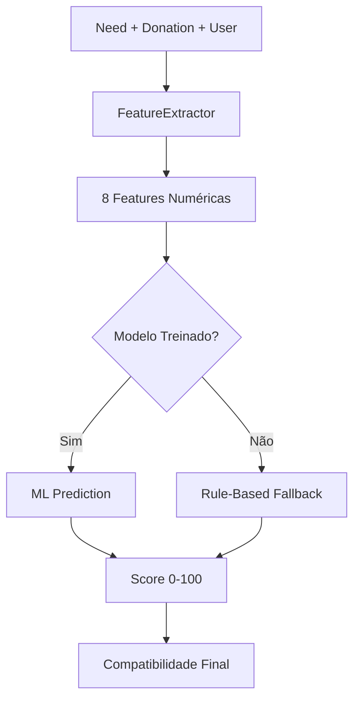

# GSAuth - Sistema de Doações com Machine Learning

## 📋 Sobre o Projeto

O **GSAuth** é uma plataforma inovadora de gerenciamento de doações que utiliza Machine Learning para otimizar o matching entre necessidades e doações. O sistema conecta doadores, organizações beneficentes e pessoas em necessidade através de um algoritmo inteligente de compatibilidade baseado em múltiplos fatores.

### 🎯 Funcionalidades Principais

- **Autenticação JWT**: Sistema seguro de login e registro
- **Gestão de Usuários**: Diferentes perfis (Doador, Membro de ONG, Admin)
- **Cadastro de Necessidades**: ONGs podem cadastrar necessidades específicas
- **Registro de Doações**: Doadores podem oferecer itens para doação
- **Matching Inteligente**: Algoritmo ML que calcula compatibilidade entre doações e necessidades
- **Sistema de Organizações**: Gestão completa de ONGs e organizações beneficentes

### 🎬 Demonstração

**Vídeo Pitch**: [https://youtu.be/k7BIZsI4AwE](https://youtu.be/k7BIZsI4AwE)

## 🏗️ Arquitetura

### Estrutura do Projeto

```
GSAuth/
├── Controllers/           # Controllers da API
│   ├── AuthController.cs         # Autenticação JWT
│   ├── ModelsController/         # CRUD dos modelos
│   │   ├── DonationController.cs
│   │   ├── MatchController.cs
│   │   ├── NeedController.cs
│   │   └── OrganizationController.cs
│   └── TestController.cs         # Endpoints de teste
├── DTOs/                  # Data Transfer Objects
├── Infrastructure/        # Configuração do banco
├── ML/                   # Sistema de Machine Learning
│   ├── Models/                   # Modelos de dados ML
│   └── Services/                 # Serviços ML
├── Models/               # Entidades do domínio
├── Repositories/         # Camada de dados
└── Services/             # Lógica de negócio

GSAuth.Tests/             # Projeto de testes
├── ML/
│   ├── Integration/             # Testes end-to-end
│   ├── Performance/             # Testes de performance
│   └── Services/                # Testes unitários
└── TestHelpers/                 # Utilitários de teste
```

## 🤖 Sistema de Machine Learning

O sistema utiliza **Microsoft ML.NET** com algoritmo **FastTree Regressor** para criar um modelo de compatibilidade que analisa 8 features principais:

### Features Analisadas

| Feature | Peso | Descrição |
|---------|------|-----------|
| **Correspondência de Categoria** | 30% | Compatibilidade entre tipos de itens |
| **Distância Geográfica** | 20% | Proximidade entre doador e beneficiário |
| **Proporção de Quantidade** | 15% | Relação entre quantidade oferecida e necessária |
| **Fator de Urgência** | 10% | Prioridade da necessidade (High/Medium/Low) |
| **Fator Temporal** | 10% | Proximidade de prazos (deadline) |
| **Fator de Expiração** | 8% | Validade da doação |
| **Confiabilidade do Doador** | 4% | Histórico baseado no tempo de cadastro |
| **Credibilidade da Organização** | 3% | Reputação da ONG |

### Algoritmo de Compatibilidade



**Score de Saída**:
- 0-30: Baixa compatibilidade
- 31-60: Compatibilidade moderada
- 61-80: Alta compatibilidade
- 81-100: Compatibilidade excelente

## 🛠️ Tecnologias Utilizadas

### Backend
- **.NET 8**: Framework principal
- **ASP.NET Core**: Web API
- **Entity Framework Core**: ORM
- **Oracle Database**: Banco de dados
- **ML.NET**: Machine Learning
- **JWT**: Autenticação
- **AutoMapper**: Mapeamento de objetos

### Machine Learning
- **Microsoft.ML 4.0.2**: Framework ML
- **FastTree Regressor**: Algoritmo de regressão
- **Feature Engineering**: Extração de 8 características

### Testes
- **xUnit**: Framework de testes
- **Moq**: Mock objects
- **FluentAssertions**: Assertions fluentes
- **Cobertura > 90%**: Testes abrangentes

### DevOps
- **Docker**: Containerização
- **Swagger**: Documentação da API

## 📦 Instalação e Configuração

### Pré-requisitos

- .NET 8 SDK
- Oracle Database
- Docker (opcional)

### 1. Clone o Repositório

```bash
git clone https://github.com/seu-usuario/GSAuth.git
cd GSAuth
```

### 2. Configuração do Banco de Dados

#### - Certifique-se que o banco está configurado:

**⚠ Siga a documentação de [GS_RESOURSEMAP_DB](https://github.com/VitorOnofreRamos/GS_RESOURSEMAP_DB) para configurar o banco antes de conectar com projeto.**

#### - Edite o arquivo `appsettings.json`:

```json
{
  "ConnectionStrings": {
    "DefaultConnection": "Data Source=seu-servidor:1521/orcl;User Id=seu-usuario;Password=sua-senha;"
  },
  "Jwt": {
    "Secret": "SuaChaveSecreta_MinimoDe32Caracteres",
    "ExpirationMinutes": 60
  }
}
```

### 3. Executar a Aplicação

```bash
dotnet run
```

A API estará disponível em: `https://localhost:5000/swagger`

### 🐳 Usando Docker

```bash
# Build da imagem
docker build -t gsauth .

# Executar container
docker run -p 8080:8080 gsauth
```

## 🔑 API Endpoints

### Autenticação

```http
POST /api/Auth/register           # Registro de usuário
POST /api/Auth/login              # Login
GET  /api/Auth/me                 # Perfil do usuário
POST /api/Auth/change-password    # Alterar senha
DELETE /api/Auth/delete-account   # Deletar conta
```

### Organizações
```http
GET    /api/Organizatio           # Listar organizações
POST   /api/Organizatio           # Criar organização
PUT    /api/Organizatio/{id}      # Atualizar organização
DELETE /api/Organizatio/{id}      # Deletar organização
```

### Necessidades

```http
GET    /api/need                  # Listar necessidades
POST   /api/need                  # Criar necessidade
PUT    /api/need/{id}             # Atualizar necessidade
DELETE /api/need/{id}             # Deletar necessidade
```

### Doações

```http
GET    /api/Donation              # Listar doações
POST   /api/Donation              # Criar doação
PUT    /api/Donation/{id}         # Atualizar doação
DELETE /api/Donation/{id}         # Deletar doação
```

### Machine Learning

```http
GET  /api/Match                           # Listar matches
POST /api/Match                           # Criar match
POST /api/Match/calculate-compatibility   # Calcular compatibilidade
POST /api/Match/train-model              # Treinar modelo ML
GET  /api/Match/model-status             # Status do modelo
```

## 👥 Tipos de Usuário

### 🎁 DONOR (Doador)
- Criar e gerenciar doações
- Visualizar matches de suas doações
- Gerenciar perfil pessoal

### 🏢 NGO_MEMBER (Membro de ONG)
- Criar e gerenciar necessidades
- Gerenciar necessidades da organização
- Aceitar/rejeitar matches

### ⚙️ ADMIN (Administrador)
- Acesso total ao sistema
- Gerenciar usuários e organizações
- Treinar e monitorar modelos ML

## 🧪 Sistema de Testes

### Estrutura de Testes

O projeto possui cobertura abrangente de testes com foco especial no sistema de ML:

#### Testes de Machine Learning

- **Testes de Integração**: Validação end-to-end do fluxo ML
- **Testes de Performance**: Predições < 10ms, Treinamento < 30s
- **Testes de Serviços**: Validação da lógica de negócio
- **Testes de Features**: Extração e cálculo das características

#### Executar Testes

```bash
# Todos os testes
dotnet test

# Apenas testes ML
dotnet test --filter "FullyQualifiedName~GSAuth.Tests.ML"

# Com cobertura
dotnet test --collect:"XPlat Code Coverage"
```

### Métricas de Qualidade

- **Coverage ML**: > 90%
- **Coverage Geral**: > 80%
- **Thread Safety**: Validado
- **Performance**: Dentro dos limites

## 🔒 Segurança

### Autenticação & Autorização
- **JWT Tokens** com expiração configurável
- **Role-based access control**
- **Proteção de endpoints** sensíveis
- **Validação de propriedade** de recursos

### Proteção de Dados
- **Hash de senhas** com salt
- **Validação de entrada** rigorosa
- **Sanitização de dados**
- **HTTPS** obrigatório em produção

## 🚀 Deploy

### Variáveis de Ambiente

```bash
ASPNETCORE_ENVIRONMENT=Production
ConnectionStrings__DefaultConnection=sua-string-conexao
Jwt__Secret=sua-chave-secreta-segura
```

### Docker Compose

```yaml
version: '3.8'
services:
  gsauth:
    build: .
    ports:
      - "8080:8080"
    environment:
      - ASPNETCORE_ENVIRONMENT=Production
      - ConnectionStrings__DefaultConnection=Data Source=oracle:1521/orcl;User Id=user;Password=pass;
    depends_on:
      - oracle

  oracle:
    image: container-registry.oracle.com/database/express:latest
    ports:
      - "1521:1521"
    environment:
      - ORACLE_PWD=yourpassword
```

## 📊 Monitoramento

### Métricas ML
- **Latência de Predição**: < 10ms (média)
- **Tempo de Treinamento**: < 30s
- **Disponibilidade**: 99.9% (com fallback)
- **Precisão**: Score correlaciona com matches reais

### Logging Estruturado
- Autenticação de usuários
- Operações CRUD
- Treinamento de modelos ML
- Cálculos de compatibilidade

## 🤝 Contribuição

### Como Contribuir

1. Fork o projeto
2. Crie uma branch para sua feature (`git checkout -b feature/AmazingFeature`)
3. Commit suas mudanças (`git commit -m 'Add some AmazingFeature'`)
4. Push para a branch (`git push origin feature/AmazingFeature`)
5. Abra um Pull Request

### Convenções

- **Commits semânticos**: `feat:`, `fix:`, `docs:`, etc.
- **Cobertura de testes**: > 80%
- **Documentação**: APIs documentadas com Swagger
- **Code standards**: Seguir padrões C# e .NET

## 📈 Roadmap

### Próximas Versões

- **v2.0**: Sistema de notificações em tempo real
- **v2.1**: API de geolocalização avançada com coordenadas reais
- **v2.2**: Dashboard analytics para ONGs
- **v2.3**: App mobile React Native
- **v2.4**: Integração com redes sociais
- **v2.5**: Sistema de avaliação e feedback

### Melhorias do ML

- **Dados Reais**: Substituir dados sintéticos por histórico real
- **Geocoding**: Cálculo real de distâncias geográficas
- **Deep Learning**: Redes neurais para padrões complexos
- **NLP**: Análise de texto nas descrições
- **Real-time Learning**: Atualização contínua baseada em feedback

## 👥 Equipe de Desenvolvimento
- Beatriz Silva - RM552600
- Vitor Onofre Ramos - RM553241
- Pedro Henrique Soares Araujo - RM553801

## 🙏 Agradecimentos

- **FIAP** pela orientação acadêmica
- **Comunidade .NET** pelo suporte técnico
- **Colaboradores e testadores** pelo feedback
- **ONGs parceiras** no desenvolvimento

---

<div align="center">

**GSAuth** - Conectando corações através da tecnologia 💙

[🌟 Star no GitHub](https://github.com/VitorOnofreRamos/GSAuth) | [🐛 Report Bug](https://github.com/VitorOnofreRamos/GSAuth/issues) | [💡 Request Feature](https://github.com/VitorOnofreRamos/GSAuth/issues)

</div>
